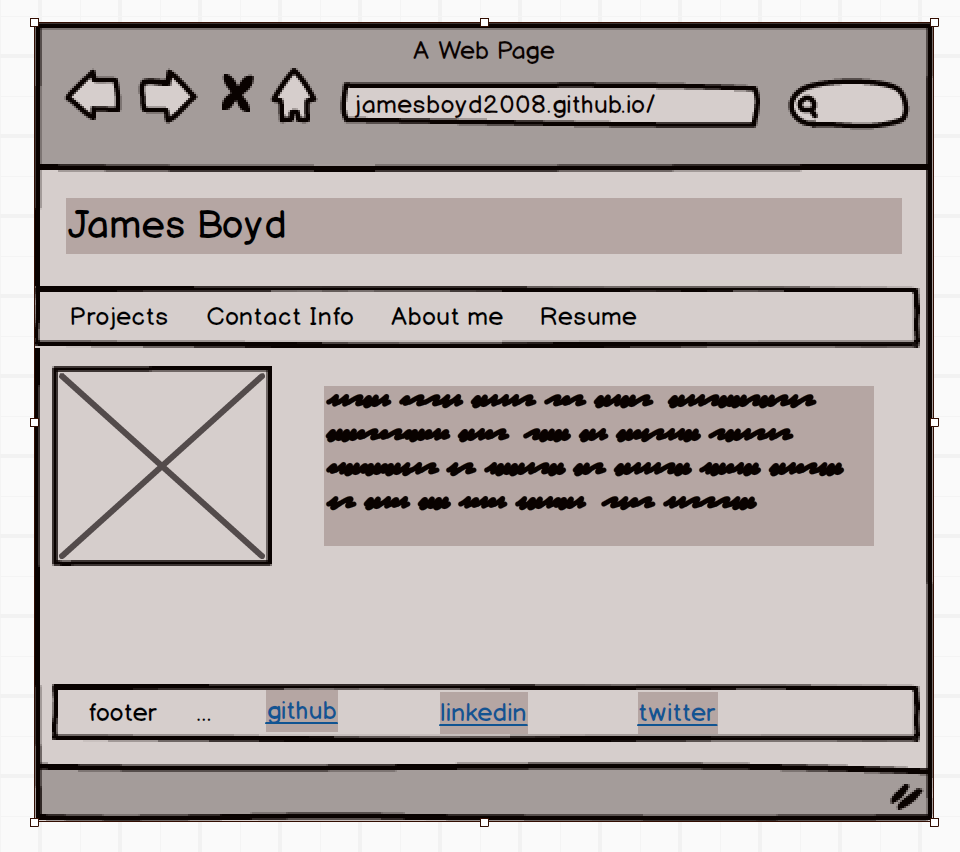
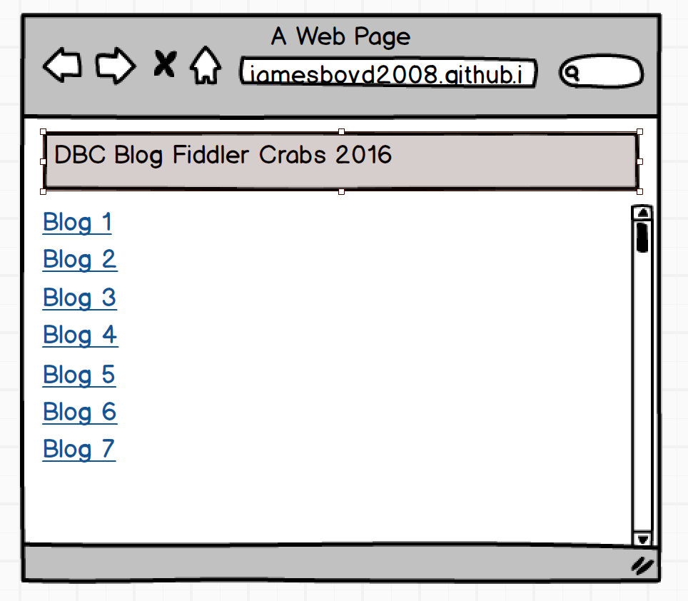

<ol>
<li>
What is a wireframe?

A wireframe is a sketch/mockup of what a web page will, hopefully, generally look like, as far as design is concerned.
</li>

<li>
What are the benefits of wireframing?

Wireframing saves time by giving an individual/team a general plan from which to work, similar to a rough sketch of a construction project from which to base blueprints.
</li>

<li>
Did you enjoy wireframing your site?

Yes.  I suspect I will enjoy it more when I'm more familiar with how it aids in a smooth transition to the development phase, especially concerning the pixel width of boxes and such.
</li>

<li>
Did you revise your wireframe or stick with your first idea?

I revised it to dress it up a bit.  Doing this was easier with the software on my machine vs. a hand sketch.
</li>

<li>
What questions did you ask during this challenge? What resources did you find to help you answer them?

I wanted to know how to expedite wireframing.  I used [balsamiq](https://balsamiq.com) to make my wireframes, thinking that revisions would be easier that way than with a pencil and paper.
</li>

<li>
Which parts of the challenge did you enjoy and which parts did you find tedious?

I enjoy the brief conceptual part of projects.  Learning new image-editing softwares can seem tedious.
</li>
</ol>