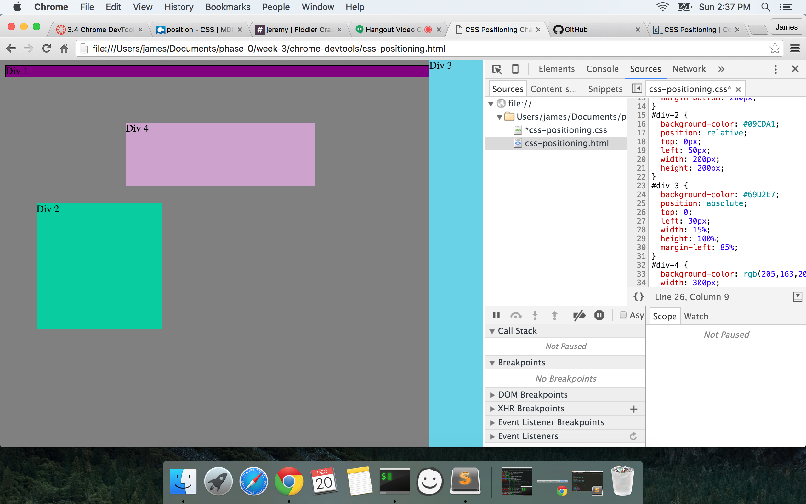

<ul>
	<li>How can you use Chrome's DevTools inspector to help you  
		format or position elements?</li>  
	You right click a blank space on the webpage, and click inspect,  
	or you go to View-Developer-Developer Tools.  The inspector helps  
	relate chunks of HTML to their CSS.  It's fast.  

	<li>How can you resize elements on the DOM using CSS?</li>  
	You modify a given element by adjusting the values of properties  
	like `height`, and `width`.  

	<li>What are the differences between absolute, fixed,  
		static, and relative positioning?  
		Which did you find easiest to use? Which was most difficult?</li>  
		<ul>
			<li>`absolute` positioning emplaces an element based off the nearest  
			parent with an `absolute` `position`.  If no parent element has an  
			`absolute` `position`, then it's the same as being `static`.
			<li>`fixed` positioned elements are "glued" to the scree, motionless  
			when scrolling.</li>
			<li>`static` positioned elements are just plopped on the scree.</li>
			<li>`relative` positioned elements' emplacements are based off  
				the `<html>` element.  I do not know the difference between  
				a `static` `position` and a `relative` `position`.</li>
		</ul>  

	<li>What are the differences between margin, border, and padding?</li>  
</ul>  

  

<ul>
	<li>What was your impression of this challenge overall? (love, hate, and why?)</li>  
	This challenge was good because I need to do the things I am  
	trying to learn.  Repetition smushes things into my brain.
</ul>
