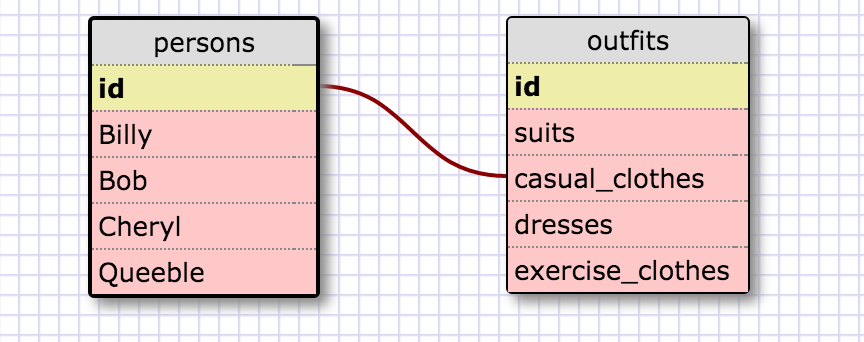

##8.4 Introduction to Database Schemas and SQL

1. Select all data for all states.  

        select * from states;

2. Select all data for all regions.  

        select * from regions;

3. Select the state_name and population for all states.  

        select state_name,population from states;

4. Select the state_name and population for all states ordered by population.
The state with the highest population should be at the top.  

        select state_name, population from states
        order by population desc;

5. Select the state_name for the states in region 7.  

        select state_name from states
        where region_id = 7;

6. Select the state_name and population_density for states with a population
density over 50 ordered from least to most dense.  

        select state_name, population_density from states
        where population_density > 50
        order by population_density;

7. Select the state_name for states with a population between 1 million and 1.5 million people.  

        select state_name from states
        where population between 1000000 and 1500000;

8. Select the state_name and region_id for states ordered by region in ascending order.  

        select state_name, region_id from states
        order by region_id;

9. Select the region_name for the regions with "Central" in the name.  

        select region_name from regions
        where region_name like '%Central%';

10. Select the region_name and the state_name for all states and regions in ascending order by region_id. Refer to the region by name. (This will involve joining the tables).  

        select region_name, state_name
        from states
        inner join regions
        on regions.id = states.region_id
        order by region_id asc;

##Reflection

What are databases for?  
Databases are for storing information (collections of data) in a way that it  
can be accessed by someone.  I like to think of them as big spreadsheets.  

What is a one-to-many relationship?  
Every square is a polygon, but not every polygon is a square.  This is an example  
of a one-to-many relationship.  Every pb&j sandwich is food, but not all food is pb&j.  
Polygons have many squares.  Squares belong to polygons.  

What is a primary key? What is a foreign key? How can you determine which is which?  
A primary key is a column of values in which there are no duplicates.  A foreign key  
can have all kinds of duplicates.

How can you select information out of a SQL database? What are some general guidelines for that?  
You must use SQL commands that can be found [here](http://www.w3schools.com/sql/default.asp).  
The commands end in a semicolon.  You may break up your commands into multiple lines.  
You identify tables and columns in a database, and selection criteria.
